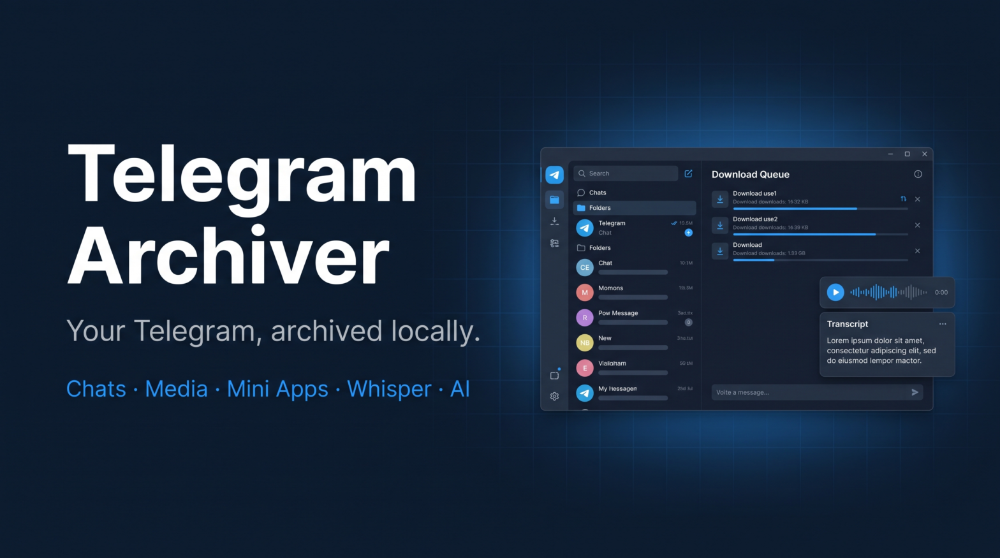

<p align="center"></p>

# Telegram Archiver

**English** | [Українська](README.uk.md)



Local open-source archiver for your own Telegram account: private and personal chats, groups, channels, media, Mini Apps, local Whisper transcription and AI digests of unread messages. Everything stays on your machine.

> ⚠️ Use only with your own account. Respect Telegram limits - aggressive exporting may get your account restricted. Do not publish archives containing other people's messages.

## Features
- QR login in 30 seconds (or phone + code + 2FA)
- Export private chats, private groups/channels, forums, archive - including content-protected chats (on by default, can be turned off in Settings)
- Media with type filters, chunked downloads, pause, retries, resume
- Export as one file or split (month / size / LLM tokens) to MD, TXT, JSON(L), HTML, CSV
- Fast local search, presets, custom topic folders
- Mini Apps: discover, open, walk through, save snapshots (MHTML, screenshots, HAR, trace)
- Local Whisper: voice and video notes -> .txt/.srt
- Unread monitor (does not mark as read) + AI analysis (Ollama local / Anthropic / OpenAI)

## Quick start
1. Get `api_id` and `api_hash` at https://my.telegram.org -> API development tools.
2. Download a release and run `TelegramArchiver.exe`, or from source just double-click `start.bat` (installs uv and builds the UI on first run).
3. Paste credentials -> scan the QR code in Telegram (Settings -> Devices -> Link Desktop Device).
4. Select chats -> "Export".

## Run from source (Windows)
Requirements: Python 3.12 + [uv](https://docs.astral.sh/uv/), Node 20+ + pnpm.
```powershell
git clone https://github.com/<owner>/tgarchiver && cd tgarchiver
./scripts/build-frontend.ps1     # builds the UI into the backend package
cd backend; uv run tgarchiver    # opens http://127.0.0.1:8765
```
Dev with hot reload: `./scripts/dev.ps1` (backend `--dev` + Vite on http://localhost:5173). All checks: `./scripts/test.ps1`.

Optional modules (installed separately to keep the base app small):
- Whisper transcription: `cd backend; uv sync --extra whisper`
- Mini Apps snapshots: `cd backend; uv sync --extra miniapps; uv run playwright install chromium`

## Secrets and `.env`

API ID/hash, the Telegram session and AI keys are entered in the UI and stored in the OS keyring (Windows Credential Manager), never in the repo. For dev/headless setups you can copy `.env.example` to `.env` (git-ignored) - env values are used only as a fallback.

## Build an exe
```powershell
./scripts/build.ps1                     # Nuitka, needs MSVC Build Tools -> dist/TelegramArchiver.exe
./scripts/build.ps1 -Tool pyinstaller   # quicker dev build
```

Specification (Ukrainian) - [`docs/`](docs/). AI assistant guide - [`CLAUDE.md`](CLAUDE.md).

## License
MIT (or AGPL-3.0, to be decided before release).

---
*Not affiliated with Telegram FZ-LLC. Protected-content export is for personal archiving only - do not redistribute.*
